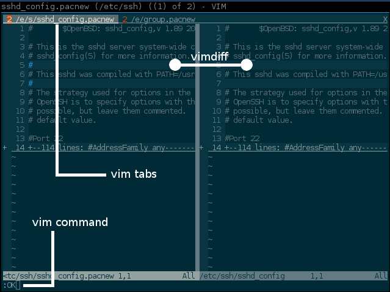

Overview
==========
**pacdiffvim** is a .pacnew file updater for vim enthusiasts. The shell script locates all .pacnew files
and opens a tab for each diff in Vim. Furthermore the script defines a special
Vim function to deal with the diff.

###Audience
Arch Linux user or user of Linux distributions which uses pacman as  the systems package manager.

###Dependencies
- Bash 4.x
- Vim 7.x

###Installation
- Download pacdiffvim <tt>wget https://raw.github.com/jens-na/pacdiffvim/master/pacdiffvim</tt>
- Put <tt>pacdiffvim</tt> to <tt>/usr/local/bin</tt>
- <tt>chmod +x /usr/local/bin/pacdiffvim</tt>

###Screenshot

Usage
==========
###Command line options
If you start <tt>pacdiffvim</tt> without any parameters, the script tries to locate all .pacnew files with <tt>find</tt>
in the directory <tt>/etc</tt> and starts vim with the found diff candidates. If there is nothing to do the script
will exit with return code 0.

* <tt>-r, --root</tt>    - You can update .pacnew files in another directory if you specify an alternative root 
                           path with <tt>-r</tt> or <tt>--root</tt>. The default directory is <tt>/etc</tt>.
* <tt>-V, --version</tt> - Shows the version and copyright info for <tt>pacdiffvim</tt>.
* <tt>-h, --help</tt>    - Shows the help for the script and exits.

**Environment variables** 
If <tt>$VIMPROG</tt> is specified, the script uses this value to start vim. The default value is 
<tt>vim</tt>. For example if you like to use <tt>gvim</tt> to compare the files you can set <tt>VIMPROG</tt>
to <tt>gvim</tt>. Example: <tt># VIMPROG=gvim pacdiffvim</tt>

###Runtime
<tt>pacdiffvim</tt> starts Vim with the special Vim command <tt>:OK</tt> to deal with the .pacnew diff.

* <tt>:OK</tt> - if you have finished the diff between the .pacnew file and the configuration file
  you should invoke this command. This function specifically does:
  * saves the configuration file
  * trys to delete the .pacnew file
  * opens your next diff (if any)

You can navigate between the diffs with standard Vim functions <tt>:tabn</tt> (next tab) 
or <tt>:tabp</tt> (previous tab)

License and Copyright
=======
Licensed under the GNU General Public License 3.

(C) Jens Nazarenus, 2013
